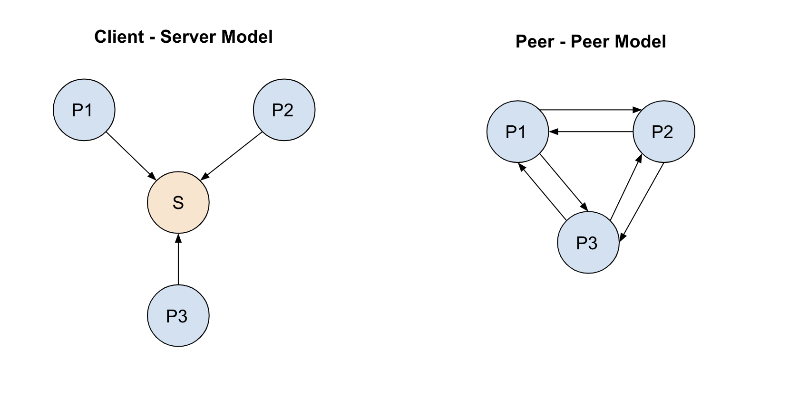

## Design Document

We implemented two designs for this project, first a client-server model and then a direct peer-to-peer communication model. Our experiments were done with the latter, however the former model was simpler to prototype due to its similarity with our last project.

### Peer-to-peer Communication Model

In our peer-to-peer communication model, we used sockets to establish direct connections between each pair of processes. Each machine had 3 threads: 
- a main thread, responsible for executing an instruction every 1/speed seconds, logging, and sending messages to other processes
- two consumer threads, each responsible for maintaining the connection with one of the other two machines and putting messages into a queue for the main thread to access(without sleeping)

*Note:* We wanted to ensure that each socket connection had a separate thread, hence why we spawned one consumer thread for each other machine we wanted to communicate with. Initially, we also wanted separate producer threads to handle the send communication to each of the other two processes, but spawning separate threads for this requires extra synchronization with the main-thread that we deemed only got in the way of our experiments.

#### Sleep Mechanism

We wanted to ensure our model did not have drift, that is, it ran the next instruction at every 1 / speed interval with as much precision as possible. In particular, we had two choices for how to implement our sleep mechanism: 

1. Have the main thread for $1/speed$ seconds after every instruction.
2. Have the main thread poll until $1/speed$ seconds have passed since the beginning of the last instruction before running the next instruction.

We ultimately chose option 2, since it avoids the problem in option 1 of the execution of instructions drifting over time (i.e. the $k$th instruction might drift to occurring after $k / speed$ seconds in). This happens because option 1 waits for $1/speed$ seconds after each instruction, i.e., it does not factor in the time it takes to execute the instruction itself. On the other hand, option 2 waits for $1/speed - instruction_{time}$ seconds, which ensures that the next instruction starts precisely at the next $1/speed$ time interval.

#### Modifying Probabilities of Events

We simply used `np.random.choice` to experiment with sampling internal and send events with different probabilities. This allowed us to change the probability of each number being sampled, so our code would not need to change the behavior for each opcode, instead each opcode simply had a different probability of occurring.

### Client-Server Model

Our client-server model was our first implementation that simply routed all messages through a centralized server. This required an additional machine / process, however, it had the added benefit of only maintaining bidirectional socket connection per client process, both directly with the server. This was in principle very similar to our code for the first project.

The process model also stored the queue of messages for each client proces on the server itself, so therefore the client would only have to add a refresh request to the server and the server would send it all the metadata about the queue. The only problem with this design at the end is the network latency being added in the model from using the server to query data that would otherwise be stored on the client process. While the latency for the server with three processes would be minimal, this would quickly escalate with more processes and virtual machines. In a deployed setting the fidelity of the model would become questionable. 