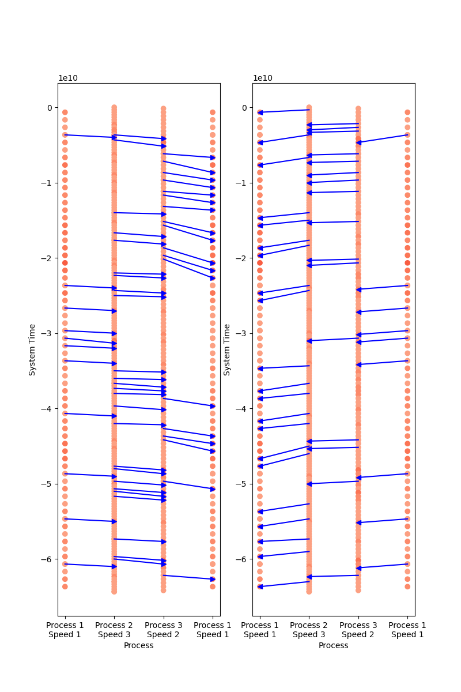

## Experiments

### Baseline Test Case

In our baseline test case we have 3 processes, each with a logicial lamport clock that are randomly selected to have differing speeds sampled uniformly from 1 to 6. This number signifies the number of ticks per second in machine time. Each machine has a 1/5 probability of sending a message to another machine and a 1/10 probability of sending it to two at the same time. Additionally, it has a 7/10 probability of logging an internal event and doing nothing. 

Our results for the baseline case are stored in `baseline-logs`. Note that for each experiment, we run at least 5 trials. 

### Baseline Takeaways

**(1) Lagging time series.** For each of the plots in our logs, we observe a lagging time series for the logical time vs. machine time where processes with slower times lag behind the faster ones. We see that the fastest processes have straight lines for the logical time. This is because they are moving the fastest and therefore any update to the logical clock will have a value that is smaller than the current value of that clock. However, for the slower processes: we see that there are random jumps that correspond to events when the faster process sends a message to the slower one, which in turn updates the lamport clock for that slower process and causes it to skip many seconds. We see this phenomena in the figure below. 

**Fig 1.** Logical Time vs. System Ground Truth Time for Baseline Case (trial-9745)

**(2) Effects of Speed on Jumps.** We see that when the disparity in the speeds of the processes is high, then there seems to be larger jumps in the slower process. However, this jump generally happens when the faster process has not communicated with the slower process in a while. If the faster process goes through a series of internal events, it increases the chance of a larger jump happening in the a slower process. 

For example, note the figure below. 

**Fig 2.** Differences in Consecutive Logical Time Events vs. System Ground Truth Time for Baseline Case (trial-1074)

In this figure we present the difference in logicial time as compared to the last event recorded $T_2 - T_1$ for each event ordered by the ground truth system time. Notice here that process 1 has the slowest speed and around the relative system time (in NS) of 10 there is a large jump in the differential. We expect that there are some jumps in the modelling, but none this large when the speeds are relatively close together. However, we can use a different view to understand how these jumps occur. Consider the figure below.

For example, note the figure below. 

**Fig 3.** Graph visualization of nodes communicating with each other and coloring based on the length of the queue. (trial-1074)

In the graph visualzation above, we see that the arrows are the messages that are sent to processes and the dots are logged events that are color coded to represent the backlog in the queue. Here we see that there is a dearth in messages beng sent to process 1 in between system time mark 2.5 and 4.5 (around the middle of the trial). This indicates to us that the large jump was likely due to the fact that no other process communicated with process 1 for a while which led to the suddent correction in time and hence a gap in the logical time that we see with the differential with **Fig 2.**

**(3) Process Time Drift.**  We notice that there is a gradual drift in slower processes over time where the clock generally falls behind over time. This drift becomes more apparent towards the end of the modelling run as it accumulates and leaves the slower processes significantly behind their faster counterparts in many cases. For example consider the the following case. 

**Fig 4.** Time series plot of logicial time versus system ground truth time with drifting processes. (trial-3533)

The plot seems counterintuitive because normally we would expect to see the jumps we saw previously when there were faster processes and there were large jumps back up to the logical time of the faster process. However, here we see that regardless, both processes have not caught up at all. At first we thought it was because the faster process was not communicating with it. However, the figure below provides clarity. 

**Fig 5.** Grpahical representation of logicial time versus system ground truth time with drifting processes. (trial-3533)

We see in the plot that the fastest process 6 recieves very few if any messages from the other processes as it assails both of the slower ones with processes. This essentially slows both of the corresponding processes in staying sychronous. This is because the rate at which the queue is being filled for the slower process $F_s$ is still faster than rate at which the queue is being decreases $R_s$ which means the queue grows at a pace of $F_s - R_s$. We can see through the coloration of the events recorded in the graphical view, the queue length builds up as the color darkens. We see that process 1 is not under the same amount of strain as process 2.

Note that while the processes are busy trying to process the next message, they are still keeping the most recent updates waiting. Hence, the longer the queue here, the larger the drift. Which is why we more drift in process 2 than process 1 in **Fig 4.** even though both have the same speed. 

### Extreme Difference in Speed Test Case

In this test case, we take the probability distribution of getting different speeds and bias it towards the ends of the spectrum such that there is an equal change of getting either 1 and 2 or 5 and 6 for the number of ticks per second.

### Takeaways

There seems to be a lot more cases of drifting, especially where there are two fast processes and one slow process. Genererally both fast processes have no gaps or lags, and the queue length for the slow process becomes extremely large. Here are two examples:

We see with both of these images that the slowest process experiences extreme drift and clear is overwhelmed in its queue by the synchronization with the faster processes that are communicating with it. In the visualization below we see that the slowest process never gets the chance to communicate with the other processes. Rather there is and overwhelming number of messages sent to it. 

)

We see in this image that the third process does not get the change to send any messages because it has a saturated queue and therefore cannot take any other actions except for receiving messages from that queue. We see the visualization of the ongoing drft as th arrows get longer. This means that the time they are being sent at, the the time the message is being processed by the recieving process is getting longer and longer. 

### Similar Speeds Test Case

We then tested the scenario where the speeds that each machine was initialized with were relatviely close to one another. In this scenario, we weight the probability of picking 1, 2, and 3 as (0.35, 0.35, 0.3) respectively. The probability of picking all all other speeds was zero. 

### Takeaways

**Less Drift.** We see a lot less drift when the speeds are similar. Most of the processes are able to keep up with the fastest ones and the queue lengths for the processes are relatively small. 

**Size of Jumps is More Consistent.** The difference between the speeds of each of the processes is very small so the lag between them is naturally smaller too. We observe that many of the processes have more regular jumps and not as many outlier jumps as seen in previous experiments. Here is an example of this. 

In this figure we see many jumps happening at 3 which is the speed ratio between process 1 and process 3, likewise we also see differences on the mulitples of 2 which is the ratio between process 1 and process 2. Unlike **Fig 2.** we do not see an extremely large jump.